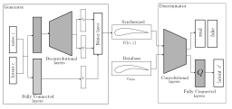

# Bezier-HingeGAN

Bezier-HingeGan is an extension of the work of Bezier-GAN work, earlier presented by Wei Chen. The following code is written with PyTorch. It generates stable and diverse aerodynamic shapes with hinge generative loss.

## Overview

Bezier-HingeGAN is a generative adversarial network model designed for *stable and diverse aero-hydrodynamic blade and airfoil shape generation*. Unlike typical GANs that generates point cloud or pixel data, Bezier-HingeGAN generates **Bezier control points and weights**, which are then rendered into smooth parametric blade/airfoil geometries.

This makes the method idea for:
 - Aerodynamic and hydropower turbine blade design
 - Generative design for engineering CAD geometries
 - Surrogate-based optimizatioh in latent space
 - Physics-informed or CFD-coupled workflows

The model improves training stability and diversity using a **hinge-loss based discriminator**.

---

## Model Architecture

--- 

## Repository Structure

    bezier-hingegan/
    │
    ├── hydFoilGAN/               # Generator and Discriminator architectures
    ├── hydFoil_data/             # Resampled hydrofoil/airfoil datasets
    ├── evals/                    # Evaluation utilities and outputs
    ├── results/                  # Generated shapes, plots, architecture figures
    │
    ├── data_setup.py             # DataLoader creation utilities
    ├── hydFoil.py                # Custom Dataset class
    ├── train_gan.py              # Main training and evaluation script
    ├── utils.py                  # Seed setup, device configuration, helpers
    ├── sbatch_gan_train.pbs      # HPC batch training script
    └── README.md

---

## Features

- Bezier-based parametric shape generation  
- Hinge loss for improved GAN stability  
- PyTorch-based modular implementation  
- Latent space control for geometry exploration  
- HPC-ready training via batch script  
- Structured dataset loading pipeline  

---

## Installation

Requirements:

- Python 3.7+
- PyTorch
- NumPy
- Matplotlib

Install dependencies:

    pip install torch numpy matplotlib

Ensure the required dataset file (for example, resampled hydrofoil data stored in `hydFoil_data/`) is available before training.

---

## Dataset

The training data consists of resampled hydrofoil or airfoil coordinates stored as NumPy arrays.  
The `hydFoil.py` file defines a custom PyTorch Dataset class, and `data_setup.py` provides utilities to create DataLoaders.

Example usage inside training:

    train_dataloader = create_dataloader(data_dir, file_name, batch_size)

---

## Training

To train the GAN:

    python train_gan.py train <latent_dim> <noise_dim>

Example:

    python train_gan.py train 3 10

Arguments:

- `train` or `evaluate`
- latent dimension size
- noise dimension size

During training, the script:

- Sets random seeds for reproducibility  
- Initializes Generator and Discriminator  
- Uses Adam optimizer  
- Trains using hinge adversarial loss  
- Saves model checkpoints  

Trained models are stored under:

    ./trained_gan/<latent>_<noise>/

---

## Evaluation

To evaluate a trained model and generate new shapes:

    python train_gan.py evaluate <latent_dim> <noise_dim>

The script loads the latest checkpoint and generates synthetic shapes, which are saved to the results directory.

---

## HPC Training

For cluster execution:

    sbatch sbatch_gan_train.pbs

Modify the batch script as needed to match your scheduler and environment.

---

## Utilities

The `utils.py` module includes:

- Seed initialization for reproducibility  
- Device setup (CPU/GPU detection)  
- Training time logging  
- Helper tensor utilities  

---

## Workflow Summary

1. Load hydrofoil dataset  
2. Initialize Generator and Discriminator  
3. Train using hinge loss  
4. Save checkpoints  
5. Evaluate and generate new parametric shapes  
6. Convert Bezier parameters to geometric coordinates  

---

## Applications

- Aerodynamic airfoil generation  
- Hydroturbine blade section generation  
- Latent space optimization  
- Surrogate-based design workflows  
- CFD-coupled generative modeling  

---

## License

.

---

## Acknowledgements

This implementation builds upon Bezier-based generative modeling concepts and focuses on improving training stability and sample diversity through hinge loss adversarial training.

